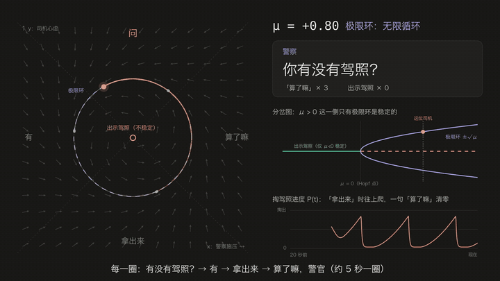

# 算了嘛，警官

> 警察：请出示驾照。　　　　司机：算了嘛，警官。\
> 警察：你有没有驾照？　　　司机：有。\
> 警察：有就请出示驾照。　　司机：算了嘛，警官。\
> 警察：不是，你有没有驾照？司机：有。\
> 警察：有就出示驾照。　　　司机：算了嘛，警官。\
> 警察：有没有驾照？　　　　司机：有。\
> 警察：你出示驾照。　　　　司机：算了嘛，警官。



完整视频：[`media/suanlema_hopf.mp4`](media/suanlema_hopf.mp4)（1080p · 30 fps · 46 秒），全部由 [`render.py`](render.py) 用 Python 渲染。

## 模型

把这段对话看成平面上的动力系统，用 Hopf 分岔的标准型（极坐标）：

$$\dot r = r(\mu - r^2), \qquad \dot\theta = \omega = \frac{2\pi}{5.05\ \mathrm{s}}$$

- **角度 θ**：对话进行到哪一句，逆时针依次是 盘问 → 有 → 请出示 → 算了嘛
- **半径 r**：离原点「出示驾照」有多远
- **μ**：司机嘴硬程度 − 警察强硬程度

|                  | μ < 0              | μ > 0                              |
|------------------|--------------------|------------------------------------|
| 原点「出示驾照」 | 稳定，迟早掏出来   | **不稳定**，差一点点也会被甩出去   |
| 极限环 r = √μ    | 不存在             | **稳定**，四句台词无限循环         |

视频里 μ = 0.8：

1. 前 14 句按原视频顺序播：开场「请出示驾照 → 算了嘛警官」，接着三轮「有没有驾照 → 有 → 请出示 → 算了嘛」，三轮措辞各不相同；播完正好是「已完成 3 个周期 · 驾照出示 0 次」；
2. 主角从离原点很近的地方出发，被甩到极限环上；从别处出发的司机（灰色）也全都落到同一个圈上；
3. 之后是假设：警察两次加大力度，把状态一把推到离原点只有 0.12、0.05 的地方——每次都被甩回去，接着说「算了嘛」；
4. 极限环的 Floquet 乘子 $e^{-2\mu T} \approx 3\times10^{-4}$：偏离每转一圈只剩万分之三，这个循环极其稳固。

要让他掏出驾照，推是没用的，只能让 μ < 0，也就是穿过 Hopf 分岔点。

右下角的 **驾照出示概率 P(t)** 是阶梯状的：盘问、有、请出示每句往上一个台阶（0.25 → 0.55 → 0.8），一句「算了嘛警官」直接清零。离原点越近台阶被顶得越高，被推到原点边上时能到 0.98，但红虚线 1.0「出示驾照」从未到达。

## 自己渲染

```bash
pip install -r requirements.txt
python render.py                 # → media/suanlema_hopf.mp4，约 40 秒渲完
python render.py --gif           # 顺带从视频里截一段做 media/preview.gif
python render.py --still 20      # 只导出第 20 秒一帧，调版面用
```

需要 `ffmpeg` 和一个中文字体（macOS 自带冬青黑体；Linux 可装 `fonts-noto-cjk`）。
